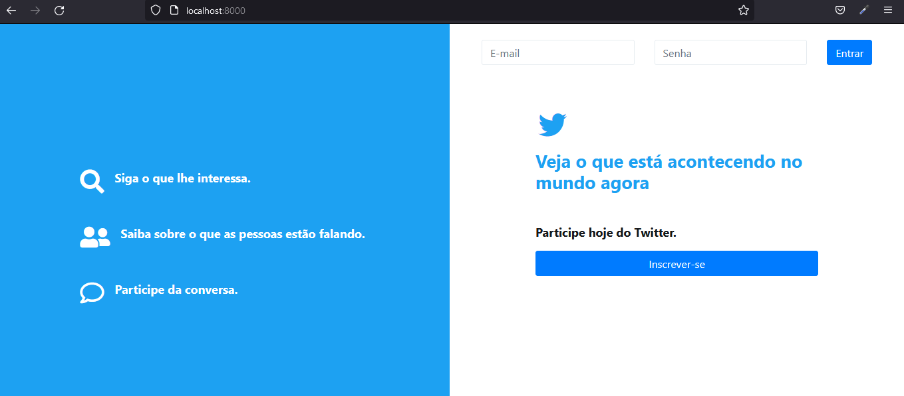
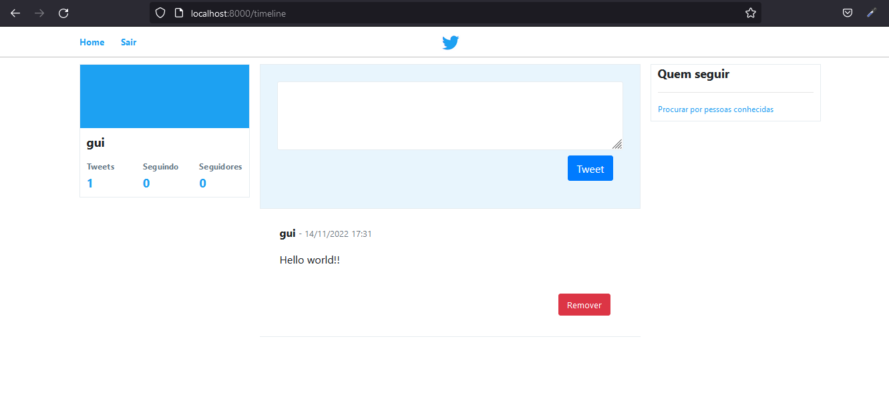
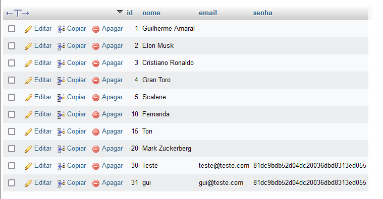
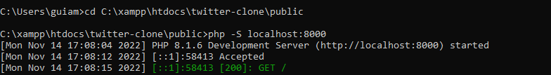

# Twitter Clone

### Descrição

- Projeto twitter clone desenvolvido para fins de estudo do PHP com MySQL, utilizando o padrão de arquitetura MVC.
- Eu amo a plataforma do twitter e admiro muito toda a equipe por trás do desenvolvimento da mesma.
- p.s. Elon Musk, please don't sue me!

### Exemplo






### Deploy do projeto

Passo 1: Primeiro faça um fork do projeto para a sua máquina na pasta 'htdocs' do xampp. <br>
Passo 2: É necessário uma versão mais recente do PHP, recomendável v7.1 ou superior. <br>
Passo 3: Ative os serviços do Apache e do Mysql através do painel do xampp. <br>
Passo 4: Acesse o arquivo 'database.sql', selecione tudo, copie e cole no seu sgbd favorito,
eu utilizei o PHPMyAdmin. <br>
Passo 5: Abra o prompt de comando e navegue até a pasta 'public' do projeto. <br>
Passo 6: Copie o caminho até a pasta, ex: 'C:\xampp\htdocs\twitter-clone\public'. 
Em seguida digite no prompt 'cd C:\xampp\htdocs\twitter-clone\public', feito isso, utilize o servidor integrado do PHP através do comando:

```cmd
php -S localhost:8000
```

<br>

Passo 7: Abra o navegador de sua preferência e digite 'localhost:8000/'. <br>

<p>Foi disponibilizado uma conta. email: teste@teste.com, senha: 1234</p>
<br><br>

Fique à vontade para acessar, explorar, abrir uma issue e colaborar!
